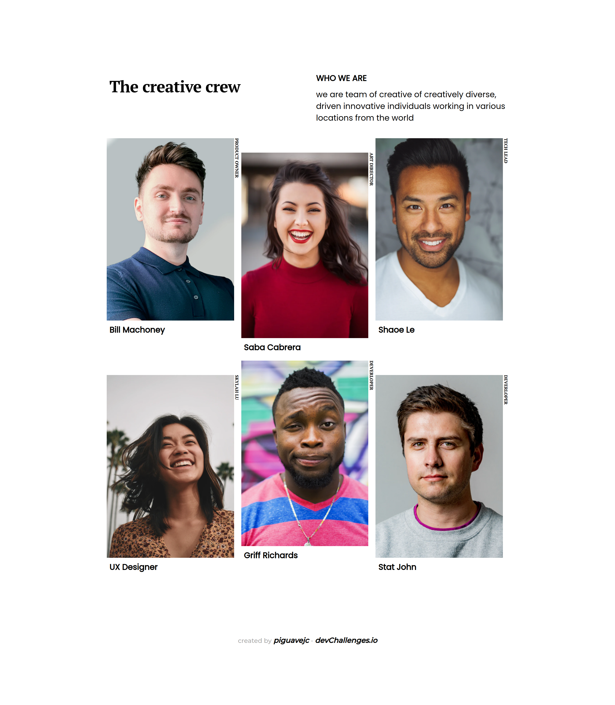

<main>
<section align="center">
    <h1 align="center"> Team Page </h1>
</section>
<section >
    <section>
        <h1 > Muestra del Sitio </h1>
    </section>
    <section >
         
         
    <section>
   
</section>
<section >
    <section>
        <h2> Lenguajes </h2>
    </section>
    <nav>
        <ul>
            <li>HTML</li>
            <li>CSS</li>
            <li>
                Preprocesadores
                <ul>
                    <li>SASS</li>
                </ul>
            </li>
        </ul>
    </nav>
</section>
<section >
    <h3> Descripciòn </h3>
    

        Esta aplicación o sitio fue creada como una presentación a un desafío de <a href="http://devchallenges.io" target="_blank">Devchallenges.io</a>. El reto consistía en construir una aplicación para completar las historias de usuario dadas.
    

</section>
<section >
    <h3> Soluciòn </h3>
    <nav>
    <ul>
        <li><a href="https://piguavejc-team-page.onrender.com/"> ver demo </a></li>
        <li><a href="https://github.com/jean-carlos-19/team-page"> ver solucion en github </a></li>
        <li><a href="https://devchallenges.io/solutions/UPsPRuQsvaufnf9LJjL0"> ver solucion en Devchallenge </a></li>
        <li><a href="https://www.figma.com/proto/QeKWLNhB13zDjJzqR22TKE/404-page-challenge?node-id=1%3A56&scaling=min-zoom&page-id=0%3A1"> ver diseños en figma </a></li>
    </ul>
</nav>
</section>

</main>
